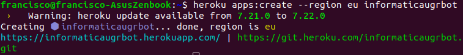
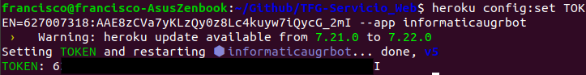
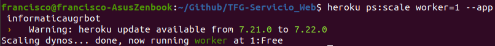
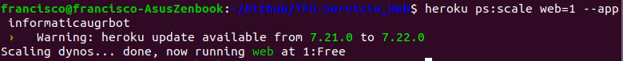

​																			<u>TRABAJO DE FIN DE GRADO</u>

​																	GRADO EN INGENIERÍA INFORMÁTICA


# 						 InformaticaUGR_Bot

## 											Servicio web


​																							**Autor**

​																		   Francisco Fernández Millán

​																							**Tutor**

​																			Juan Julián Merelo Guervós


​																			

​																			

​													Escuela Técnica Superior de Ingenierı́as Informática y de
​																					Telecomunicación
​																								—
​																			Granada, ----- de 2019


# InformaticaUGR_Bot (Servicio Web)

## Resumen

**Palabras clave**: servicio web, accesibilidad, usabilidad, scripting, información.


​	A lo largo de los años que llevo como estudiante en el grado de informática he visto grandes avances en lo que respecta a la ayuda de obtención de información para el alumno. 

​	Una de la ayudas que he podido contemplar son los Bots de Telegram que muestra cierta información como próximas actividades, próximos exámenes, etc. Prácticamente la mayoría de estas ayudas eran programadas directamente al bot o contenidos redireccionados a este. También hemos tenido a nuestra disposición, un servicio web con una base de datos en la que poder almacenar contenido de las distintas asignaturas de la carrera para así, facilitar la compartición de documentos.

​	Por otra parte, siempre he echado en falta poder consultar cierta información correspondiente al grado de forma directa y rápida, sin la necesidad de por ejemplo tener que descargar los calendarios de exámenes y buscar según la fila y la columna que día tendríamos el examen final, otro claro ejemplo puede ser, si queremos saber el horario concreto de un curso, semestre y grupo, la única forma sería descargar el PDF de los horarios el cual contiene unas 24 páginas y buscar lo que necesitamos. 

​	De forma adicional, he decidido automatizar todo el proceso de almacenamiento de datos en la base de datos, de tal forma que mediante programas, se realice la extracción de dichos datos de los propios PDFs y se incluyan en la base de datos correspondiente de forma automática sin tener que hacer este proceso a mano con cada fila.

​	Con esta idea, he decidido basar mi TFG¹ en un Servicio Web que mostrará información relevante sobre el grado de Ingeniería Informática de la ETSIIT² como fechas de exámenes junto con la hora, guías docentes de cada una de las asignaturas y horarios de cada día particular de cada grupo y curso. Toda la información será extraída mediante *scripting*³ sobre los PDFs de la facultad. Además todo esto irá también acompañado de un Bot⁴ de Telegram para aumentar su accesibilidad.


¹ TFG: Trabajo Fin de Grado

² ETSIIT: Escuela Técnica Superior de Ingenierías Informática y de Telecomunicación

³ Scripting: Se trata de la acción automatizada de tareas por parte de un script, las tareas pueden ser ejecutadas por una persona o automáticamente cada cierto intervalo de tiempo.

⁴ Bot: Programa informático que efectúa automáticamente tareas repetitivas a través de Internet, cuya realización por parte de una persona sería imposible o muy tediosa. 


## Extended abstract

**Keywords**: web service, accessibility, usability, scripting, information.

​	Throughout the years that I have been a student in the computer science degree, I have seen great progress in terms of helping to obtain information for the student.

​	One of the aids that I have been able to contemplate are the Telegram Bots that show certain information such as upcoming activities, upcoming exams, etc. Practically most of these aids were programmed directly to the bot or contents redirected to it. We have also had at our disposal, a web service with a database in which to store content of the different subjects of the race to facilitate the sharing of documents.

​	On the other hand, I have always missed being able to consult certain information corresponding to the degree directly and quickly, without the need to, for example, have to download the exam calendars and search according to the row and the column that we would have the final exam, Another clear example can be, if we want to know the specific schedule of a course, semester and group, the only way would be to download the PDF of the schedules which contains about 24 pages and look for what we need.

​	Additionally, I have decided to automate the entire process of storing data in the database, so that by means of programs, the extraction of said data from the PDFs themselves is carried out and included in the corresponding database automatically. without having to do this process by hand with each row.

​	With this idea, I have decided to base my TFG¹ on a Web Service that will show relevant information about the degree of Computer Engineering of the ETSIIT² as exam dates along with the time, teaching guides of each one of the subjects and schedules of each particular day of each group and course. All the information will be extracted by * scripting * ³ on the faculty's PDFs. In addition all this will also be accompanied by a Telegram Bot⁴ to increase its accessibility.


¹ TFG: Final Degree Project

² ETSIIT: Higher Technical School of Computer and Telecommunications Engineering

³ Scripting: It is the automated action of tasks by a script, the tasks can be executed by a person or automatically every certain interval of time.

⁴ Bot: Computer program that performs repetitive tasks automatically through the Internet, whose performance by a person would be impossible or very tedious.


## Agradecimientos

Quiero mostrar mi agradecimiento a todas y cada una de las personas que de forma directa o indirecta han participado en la realización de este proyecto.

En primer lugar, a mi tutor Juan Julián (JJ), por el apoyo recibido en este proyecto, por mostrarme una mínima parte de todo su conocimiento desde que impartí su asignatura IV la cual aprendí mucho, hasta las pautas que me mostró en todo momento para realizar mi TFG, como siempre recomendándome el uso de programas de código libre.

A mi pareja, por aguantar todas las *locuras* y *frikadas* que tiene un informático, así como, soportar cuando le muestro miles de líneas de código y me dice, "*que como me puede gustar eso que no hay quien lo entienda*" y por apoyarme en todo momento y aguantar mis agobios que no han sido pocos.

A mi familia, por apoyarme desde pequeño en todos los objetivos que me marcaba, porque sin ellos esto no habría sido posible.

Y por último, a todos los magníficos compañeros que he tenido durante estos años, entre todos hemos conseguido superar todas dificultades con las que nos hemos topado.

Muchas gracias.

Francisco Fernández.


# Índice general

[TOC]


## 1. Introducción

### 1.1. Motivación

​	La principal idia que me ha motivado a hacer este proyecto es la falta de rapidez a la hora de realizar una consulta. Siempre que he necesitado realizar una búsqueda ya sea para obtener el horario de un día concreto para un curso y un grupo, consultar la fecha de examen final para la convocatoria ordinaria de una asignatura o el simple hecho de saber que profesores junto con la forma de contactar con ellos tiene cada asignatura, he tenido que hacer uso de varios PDFs con varias páginas cada uno. 

​	Trás analizar esta necesidad, pensé en realizar todo ese procedimiento de forma automatizada para posteriormente obtener los datos de forma instantánea a través de un servicio web simplemente por ejemplo, ingresando la asignatura la cual necesitamos obtener información para el caso de los profesores que la imparten. 

​	Pienso que puede ser una buena idea ya que aumenta en gran medida la rapidez y accesibilidad a la información que necesitamos.


### 1.2. Estructura del proyecto

​	El contenido de este proyecto será el siguiente:

1. En el *capítulo 1* (**Introducción**) se encuentran las fuentes de obtención de información, la información que se mostrará como resultado final y una breve descripción sobre como llevaré a cabo el proceso de obtención y muestra de datos.
2. En el *capítulo 2 (**Extracción de datos**)* se explicará la forma que he llevado a cabo para la correcta extracción del contenido necesario para cada una de las funciones de la página, que serán las mencionadas en el apartado 1.4.
3. En el *capítulo 3 (**Almacenamiento de los datos**)* se mostrará la forma en la cual se almacenarán los datos obtenidos del capítulo anterior, así como la estructura de tablas y sus respectivas columnas que poseerá la base de datos.
4. En el *capítulo 4 (**Despliegue en un PaaS**)* se analizará de forma detallada el proceso para el despliegue del servicio web en la plataforma *Heroku*.


### 1.3. Fuentes de datos de la cuales obtener infomación sobre GII

* Horarios = https://etsiit.ugr.es/pages/calendario_academico/horarios-curso-20172018/horariosgii1718/!

* Guías docentes = https://grados.ugr.es/informatica/pages/infoacademica/guias_docentes/guiasdocentes_curso_actual

* Fecha y hora de exámenes = https://etsiit.ugr.es/pages/calendario_academico/examenes-curso-1819/calendarioexamenes1819gii/!


### 1.4. Qué infomación se mostrará

1. **Información sobre profesores y contactos**: mediante las siglas de cada una de las asignaturas del grado, obtenemos información relevante de las guías docentes como puede ser, los profesores que imparten esa asignatura y como contactar con cada uno de ellos.
2. **Información sobre horarios**: introduciendo el curso, el semestre, el grupo y por último, el día de la semana el cual queremos consultar. Se mostrará la información correspondiente a ese día en concreto del curso, semestre y grupo seleccionado. La información vendrá compuesta por la hora en la que se da cada asignatura, la asignatura en cuestión junto con su grupo reducido si corresponde a un subgrupo de prácticas y por último, en aula donde se impartirá.
3. **Información sobre fecha exámenes**: seleccionamos las siglas de la asignatura de la cual queremos saber su fecha de examen final, además de su sigla debemos indicar a qué semestre corresponde y la convocatoria, que puede ser ordinaria o extraordinaria. El resultado será la fecha del examen de la asignatura introducida, además se mostrará con una M o una T si el turno es de mañana o de tarde.


### 1.5. Descripción sobre como llevaré a cabo la extracción y visualización de los datos

​	De forma breve y esquemática de como es la idea que he llevado a cabo desde como extraer los datos hasta como mostrarlos en la web es la siguiente:

1. Lo primero es obtener la fuente de la cual vamos a extraer la información, dicha fuente se encuentra en la propia página de la ETSIIT o en la página de grados para el caso de las guías docentes. 
2. Una vez descargados los PDFs que nos interesan, procedemos a la extracción de los datos. Para ello necesito hacer uso de una librería la cual me reconozca la estructura de las tablas que contiene el documento. Después de haber obtenido la librería necesaria, convertimos el archivo a formato *csv* y realizamos los test necesarios para comprobar que el contenido en ambos formatos es el mismo.
3. Cuando ya tenemos el documento convertido en un formato en el que podemos trabajar con más facilidad, buscamos la forma de obtener los datos que son relevantes para a continuación almacenarnos en la base de datos correspondiente.
4. Por último, después de haber almacenado la información que nos interesa en la BD, desde la web, realizamos consultas a ella para mostrar según las especificaciones del usuario, el resultado de la búsqueda.


## 2. Extracción de datos

Debido a que los datos se encuentran en PDFs estructurados en tablas, he tenido que hacer uso de una librería para Python la cual me extraiga los datos necesarios para posteriormente añadirlos a la BD.

### 2.1. Selección de la biblioteca necesaria

Antes de nombrar las bibliotecas que he probado hasta quedarme con la adecuada, voy a mostrar el test realizado a cada una de ellas:

```python
#!/usr/bin/env python
# -*- coding: utf-8 -*-

import os
import sys
import unittest
import binascii

from PyPDF2 import PdfFileReader, PdfFileWriter

RESOURCE = './resources'

class PdfReaderTestCases(unittest.TestCase):
    def test_PdfReaderFileLoad(self):
        with open(os.path.join(RESOURCE, 'ejemploPDF.pdf'), mode='rb') as inputfile:
            # Load PDF file from file
            ipdf = PdfFileReader(inputfile)
            ipdf_p1 = ipdf.getPage(0)

            # Retrieve the text of the PDF
            pdftext_file = open('./resources/out_page.txt', 'r')
            pdftext = pdftext_file.read().strip()
            pdftext_file.close()

            ipdf_p1_text = ipdf_p1.extractText().replace('\n', '').strip()

            # Compare the text of the PDF to a known source
            self.assertEqual(ipdf_p1_text, pdftext,
                msg='PDF extracted text differs from expected value.\n\nExpected:\n\n%r\n\nExtracted:\n\n%r\n\n'
                    % (pdftext, ipdf_p1_text))
                    
if __name__ == '__main__':
    unittest.main()
```

El test se encarga de comprobar que se realiza correctamente la lectura del archivo, la conversión al formato deseado y por último, realiza una comparación entre el contenido leído y el contenido extraído, de esta forma verifica que son iguales y por tanto pasaría el test.


Bibliotecas que he probado y he tenido que descartar:

- **PyPDF2**: Después de haber probado un poco esta biblioteca, conseguí abrir y leer el PDF, al mostrar el contenido de la lectura me aparece el texto codificado, por tanto, lo he convertido en ASCII para posteriormente guardarlo en un fichero .txt y a partir de el obtener información. El problema que le encuentro es a la hora de obtener la columna correspondiente a la fila de la tabla ya que tengo como salida un fichero de texto. 

  Un ejemplo de una de las funciones utilizadas para la extracción de datos es el siguiente:

```python
def text_extractor(path):

    print ("Abriendo " + sys.argv[1])

    pdf_file = sys.argv[1]
    read_pdf = PyPDF2.PdfFileReader(pdf_file)

    number_of_pages = read_pdf.getNumPages()
    print (str(number_of_pages) + " páginas leídas")

    out_page_content = 'out_page.txt'
    os.system(("ps2ascii %s %s") %( pdf_file , out_page_content))

    convocatoria = "Ordinaria"
    asignatura = input("Asignatura a buscar: ")
    repetidas = 0
    f = open("out_page1.txt", "r")
    lines = f.readlines()

    # Extraemos línea de los días de exámenes
    dias = []
    for line in lines:
        diasEx = line.split()
        for p in diasEx:
            if p==convocatoria:
                dias = diasEx
    cont = 0
    while cont < 4:
        dias.pop(0)
        cont+=1

    print(dias)

    # Extraemos línea de la asignatura en concreto
    for line in lines:
        palabras = line.split()
        for p in palabras:
            if p == asignatura:
                repetidas = repetidas+1
                print(palabras)
                if palabras[len(palabras)-1] == 'M':
                    print ("Exámen a las 9:00")
                elif palabras[len(palabras)-1] == 'T':
                    print ("Exámen a las 16:00") 
```

​		Después de encontrarme con este problema, decidí pasar el contenido a .*csv*, y así poder recorrer cada 		fila y columna, pero no me representaba bien la estructura del PDF en cuestión ya que me 					             		interpretaba cada palabra como una celda, por tanto, a la hora de querer saber la fecha (columna) de 		una determinada asignatura (fila), era imposible. Tenía que  por lo que tuve que recorrer cada nombre 		de cada asignatura para contar el número de espacios que tenía y luego restarlo para obtener la 		         		columna exacta. También se añadía el problema de que la fila perteneciente a los días de convocatoria, 		no se ajustaban a sus celdas originales ya que en la conversión descartaba las tabulaciones y 		                                                        		combinaciones de celda. Debido a estos problemas con esta librería, no conseguí que pasara el test de 		comparación de contenido.	

​		Un ejemplo de como esta librería convierte el contenido a .*csv* es el siguiente:


- **PDFMiner**: Extrae correctamente un documento de texto en PDF, he conseguido que pase los test comparando la lectura del PDF en cuestión con el texto obtenido tras la extracción si el PDF que uso es de texto, el problema viene cuando contiene tablas.
  
El código utilizado para la extracción y conversión es el siguiente:
  
  ```python
  import csv
  import os
  from miner_text_generator import extract_text_by_page
  
  def export_as_csv(pdf_path, csv_path):
      filename = os.path.splitext(os.path.basename(pdf_path))[0]
      counter = 1
      with open(csv_path, 'w') as csv_file:
          writer = csv.writer(csv_file)
          for page in extract_text_by_page(pdf_path):
              text = page[0:100]
              words = text.split()
              writer.writerow(words)
  
  if __name__ == '__main__':
      export_as_csv(pdf_path, csv_path)
  ```
  
  Un ejemplo de salida tras la conversión es el siguiente:
  
  
  
  Como se puede observar, todo se muestra en una sola fila ya que no trabaja bien con la estructura del PDF y por consiguiente, no puedo acceder a la columna que le corresponde a cada fila. Aún así, tampoco consigo que pase el test de comparación de contenido
  
- **tabula-py**: Esta librería trabaja correctamente con tablas pero deben de tener una cierta estructura para realizar correctamente la lectura. Cuando nos encontramos con celdas combinadas se producen errores en la extracción. El siguiente código se encarga de leer y convertir el contenido:

  ```python
  import tabula
  
  # Read pdf into DataFrame
  df = tabula.read_pdf("test.pdf", options)
  
  # Read remote pdf into DataFrame
  df2 = tabula.read_pdf("https://github.com/tabulapdf/tabula-java/raw/master/src/test/resources/technology/tabula/arabic.pdf")
  
  # convert PDF into CSV
  tabula.convert_into("CalendarioExamenes18-19-GII.pdf", "output.csv", output_format="csv")
  
  # convert all PDFs in a directory
  tabula.convert_into_by_batch("input_directory", output_format='csv')
  ```

  

  El resultado es similar al de la librería PyPDF, con la diferencia que en este caso las celdas combinadas en vertical, se añaden en la siguiente columna en lugar de en la siguiente fila. Aún así tenemos el mismo problema de mala estructuración y por ello no consigue pasar el test de comparación de datos. 

   


- **camelot**: Al final, tras muchas pruebas y agobios debido al formato/estructura de los PDFs, encontré la biblioteca *camelot* la cual consiguió pasar los test, además incluye ventaja de ser capaz de detectar en un PDF donde se encuentra una tabla si por ejemplo está rodeada de texto, así como otras más. Para realizar la lectura y conversión con esta librería, he usado el siguiente código:

  ```python
  #!/usr/bin/env python
  # -*- coding: utf-8 -*-
  
  import camelot
  import csv
  import os
  import pandas as pd
  import sys
  import psycopg2
  
  RESOURCE = './resources'
  OUTPUT = './outputs'
  
  def extractDataTable1_1SemOrdinaria(asignaturaEX):
      tablas = camelot.read_pdf(os.path.join(
          RESOURCE, 'CalendarioExamenes18-19-GII.pdf'))
      tablas.export(os.path.join(
          OUTPUT, 'CalendarioExamenes18-19-GII.csv'), f='csv', compress=False)
  
      with open(os.path.join(OUTPUT, 'CalendarioExamenes18-19-GII-page-1-table-1.csv'), 'r') as archivo:
          datos = pd.read_csv(archivo, header=-1)
          ....
  ```

  A partir de un documento PDF, realizo la lectura para posteriormente exportar su contenido a un formato de tablas como *csv*. Una vez que tengamos el contenido en tablas, procedemos a abrirlo y trabajar sobre el.

  Los tests que les he realizado a esta librería, aparte de los primero tests que ha sido comunes para todas ellas, es el siguiente:

  ```python
  #!/usr/bin/env python
  # -*- coding: utf-8 -*-
  
  import os
  import sys
  import unittest
  import camelot
  import csv
  
  import pandas as pd
  from pandas.util.testing import assert_frame_equal
  
  RESOURCE = './resources'
  OUTPUT = './outputs'
  
  
  class TestsCAMELOT(unittest.TestCase):
      def test_parsing_report(self):
          parsing_report = {
              'accuracy': 99.02,
              'whitespace': 12.24,
              'order': 1,
              'page': 1
          }
  
          filename = os.path.join(RESOURCE, 'foo.pdf')
          tables = camelot.read_pdf(filename)
          assert tables[0].parsing_report == parsing_report
  
      def test_PdfReaderFileLoad(self):
          tables = camelot.read_pdf(os.path.join(RESOURCE, 'foo.pdf'))
  
      def test_CsvReaderFileLoad(self):
          with open(os.path.join(OUTPUT, 'foo.csv')) as File:
              reader = csv.reader(File)
  
      def test_ConvertToCsv(self):
          tables = camelot.read_pdf(os.path.join(RESOURCE, 'foo.pdf'))
          tables.export(os.path.join(OUTPUT, 'foo.csv'), f='csv',
                        compress=False)  # json, excel, html
  
      def test_ComparePdfCsv(self):
          tables = camelot.read_pdf(os.path.join(RESOURCE, 'foo.pdf'))
          resultsPDF = []
  
          for row in tables:
              resultsPDF.append(tables[0].df)
  
          resultsCSV = pd.read_csv(os.path.join(OUTPUT,'foo.csv'), header=-1)
          resultsCSV_sin_nan = resultsCSV.fillna(value='')
  
          print('EXTRACT TO PDF')
          print(tables[0].df)
          print('----------------------')
          print('EXTRACT TO CSV')
          print(resultsCSV_sin_nan)
  
          assert_frame_equal(tables[0].df, resultsCSV_sin_nan)
  
  
  if __name__ == '__main__':
      unittest.main()
  
  ```

   En este test, he individualizado cada función y he realizado pruebas de lectura en ambos formatos, conversión y comparación de contenidos. La siguiente imagen corresponde a la salida por terminal de la última función que muestra el contenido de un PDF extraído mediate *Camelot* en la primera tabla y en la segunda es propio contenido convertido a *csv*, como se puede observar es exactamente igual. Por tanto, es la mejor elección ya que a la hora de realizar la extracción, el resultado será igual que el de la tabla de entrada.


Y por último, voy a mostrar como se almacena el contenido extraído en formato *csv*:


Como se puede observar, ahora si tenemos una estructura a partir de la cual poder trabajar correctamente.


### 2.2. Información sobre la biblioteca seleccionada

La información citada a continuación es obtenida del propio [manual](https://buildmedia.readthedocs.org/media/pdf/camelot-py/master/camelot-py.pdf) de la biblioteca:

> ```
> El formato PDF (Formato de Documento Portátil) nació de The Camelot Project para crear "una forma universal de comunicación documentos a través de una amplia variedad de configuraciones de máquinas, sistemas operativos y redes de comunicación ”. El objetivo era hacer que estos documentos puedan verse en cualquier pantalla e imprimirse en cualquier impresora moderna. La invención de el lenguaje de descripción de página PostScript, que permitió la creación de documentos planos de diseño fijo (con texto, fuentes, Gráficos, imágenes encapsuladas), resolvió este problema.
> En un nivel alto, PostScript define instrucciones, como "coloque este carácter en esta coordenada x, y en un plano".
> Se puede simular colocando caracteres relativamente separados. A partir de eso, las tablas se pueden simular colocando caracteres (que constituyen palabras) en celdas bidimensionales. Un visor de PDF simplemente toma estas instrucciones y dibuja todo para que el usuario lo vea. Como un PDF es solo caracteres en un plano, no hay una estructura de datos de tabla que pueda ser extraído y utilizado para el análisis!
> Lamentablemente, muchos de los datos libres de hoy día están atrapados en tablas PDF.
> ```

> ```
> -¿Por qué esta biblioteca y no otra?
> Existen herramientas de código abierto (Tabula, pdf-table-extract) y de código cerrado (smallpdf, PDFTables) que son ampliamente utilizadas para extraer tablas de archivos PDF. O bien dan un buen resultado o fallan miserablemente. No hay término medio. Esto no es útil ya que todo en el mundo real, incluida la extracción de tablas PDF, es borroso. Esto lleva a la creación de ad-hoc.
> Scripts de extracción de tablas para cada tipo de tabla PDF.
> Camelot fue creado para ofrecer a los usuarios un control completo sobre la extracción de tablas. Si no puede obtener la salida deseada con la configuración predeterminada, puede modificarlos y hacer el trabajo!
> ```

De forma adicional se puede consultar la [comparativa](https://github.com/socialcopsdev/camelot/wiki/Comparison-with-other-PDF-Table-Extraction-libraries-and-tools) entre esta biblioteca y otras, de forma que se deja claro que es la mejor elección que podemos encontrar.


### 2.3. Extracción de información

Una vez que conseguí encontrar la librería adecuada para mi programa, el siguiente reto fue como a partir de la extracción a una tabla csv poder obtener los datos que me interesaban. 

Para ello hice uso de *Pandas*, que se trata de una librería en Python destinada al análisis de datos, que proporciona unas estructuras de datos flexibles y permiten trabajar con ellos de forma muy eficiente. En mi caso he utilizado las estructuras de datos *DataFrame*.

Con este tipo de estructura, tras la lectura del fichero csv con Pandas, podía seleccionar las filas y columnas que necesitara de cada tabla, obteniendo así los datos necesarios.

A continuación mostraré ejemplos sobre funciones que he realizado en cada uno de los programas encargados de la extracción de información.

- **extractDataGII.py**: Script en Python que de forma muy breve se encarga obtener la fecha de examen final de una asignatura introducida. Un ejemplo de la función encargada de obtener la información a través de la tabla correspondiente al primer semestre de la convocatoria ordinaria sería:

  ```python
  def extractDataTable1_1SemOrdinaria(asignaturaEX):
      tablas = camelot.read_pdf(os.path.join(
          RESOURCE, 'CalendarioExamenes18-19-GII.pdf'))
      tablas.export(os.path.join(
          OUTPUT, 'CalendarioExamenes18-19-GII.csv'), f='csv', compress=False)
  
      with open(os.path.join(OUTPUT, 'CalendarioExamenes18-19-GII-page-1-table-1.csv'), 'r') as archivo:
          datos = pd.read_csv(archivo, header=-1)
          datosNoNaN = datos.fillna(value='0')
          
                  cont14E = 0
          cont14Easig = 0
          exAsig14E = []
  
          while cont14E < contTope:
              if(examenes14Ene[cont14E] == 'M'):
                  asignatura = datosNoNaN.iloc[cont14E, :]
                  cont14Easig = 0
                  while cont14Easig < contAsig:
                      if(asignatura[cont14Easig] >= 'A' and asignatura[cont14Easig] <= 'z'):
                          exAsig14E.append(str(asignatura[cont14Easig]))
                      cont14Easig += 1
              elif(examenes14Ene[cont14E] == 'T'):
                  asignatura = datosNoNaN.iloc[cont14E, :]
                  cont14Easig = 0
                  while cont14Easig < contAsig:
                      if(asignatura[cont14Easig] >= 'A' and asignatura[cont14Easig] <= 'z'):
                          exAsig14E.append(str(asignatura[cont14Easig]))
                      cont14Easig += 1
              cont14E += 1
              
          cont = 0
          while(cont < len(exAsig14E) and (encontrado == False)):
              if(exAsig14E[cont] == asignaturaEX):
                  resultado.append("14 de Enero")
                  resultado.append(exAsig14E[cont])
                  resultado.append(exAsig14E[cont+1])
                  resultado.append(exAsig14E[cont+2])
                  encontrado = True
              cont += 1
  ```

  Esta parte del código correspondiente a la función mencionada se encarga en primer lugar, leer el contenido del PDF correspondiente y convertirlo en formato *csv*. Una vez lo tenemos en el formato con el que queremos trabajar, lo abrimos y leemos su contenido. 

  En este caso estamos buscando la asignatura pasada como parámetro en la lista que almacena el contenido de los exámenes del 14 de Enero, obviamente esto mismo hay que hacerlo con cada uno de los días de la convocatoria. Recorremos su recorrido en busca de datos que son de nuestro interés y lo vamos guardando.

  Cuando ya tenemos recorrido y guardada toda la información que había en la lista, podemos decir que tenemos en la lista donde se almacena, la información de ese día en esa convocatoria.

  Posteriormente, como se muestra en el último *while*, se realiza una búsqueda en esta última lista mencionada en busca de la asignatura que estamos consultando. 

  Si la asignatura que queremos obtener pertenece a ese día pues se guarda en la variable *resultado* para a continuación devolverla en el *return* de la función.

  De esta misma forma deberemos proceder con cada una de la tablas que contiene el PDF en cuestión.
  
- **extractDataGII_GD.py**: Script en Python que de forma muy breve se encarga obtener de la guía docente de la asignatura, la información sobre los profesores que la imparten y sus contactos. Un ejemplo de la función encargada de obtener la información a través de la tabla correspondiente a la asignatura CA (Cálculo) es la siguiente:

  ```python
  def extractDataTeable_GuiaDocente(asignatura):    
      if asignatura == 'CA':
          tablas = camelot.read_pdf(os.path.join(RESOURCE, 'Cаlculo-Grado-Informatica-17-18.pdf'), pages='2')
          tablas.export(os.path.join(OUTPUT, 'Cаlculo-Grado-Informatica-17-18.csv'), f='csv', compress=False)
  
          with open(os.path.join(OUTPUT, 'Cаlculo-Grado-Informatica-17-18-page-1-table-2.csv'), 'r') as archivo:
              datos = pd.read_csv(archivo, header=0)
              datosNoNaN = datos.fillna(value='')
  
              profesores = (datosNoNaN.iloc[:, 0])
              contactos = (datos.iloc[:, 1])
  
              listProfesores = []
              for x in profesores:
                  listProfesores.extend(x.strip().split('\n'))
  
              listContactos = []
              for x in contactos:
                  listContactos.extend(x.strip().split('\n'))
  ```

  De esta forma, a partir de la lectura de la propia guía docente y su conversión, seleccionamos la página que nos interesa donde se muestra la información de los profesores. Leemos nuestro archivo ya convertido en tabla *csv*, seleccionamos el contenido que nos interesa y lo guardamos en listas con el formato requerido, a partir de esto, para cada asignatura introducida como parámetro, se devolverá una lista con los profesores y los contactos de cada uno de ellos.


- **extractDataGII_HO.py**: Por último, este Script de Python se encarga de a partir del curso, grupo y semestre y día introducido, nos devuelva el horario de este último. Un ejemplo de la función encargada de obtener la información a través de la tabla correspondiente al primer curso, grupo A, primer semestre y como día, el lunes,  es la siguiente:

  ```python
  def extractDataTable1_1A1C_1A2C(cuatrimestre, dia):
      tablas = camelot.read_pdf(os.path.join(
          RESOURCE, 'HORARIOS1819.pdf'), pages='1')
      tablas.export(os.path.join(
          OUTPUT, './HORARIOS/HORARIOS1819.csv'), f='csv', compress=False)
  
      with open(os.path.join(OUTPUT, './HORARIOS/HORARIOS1819-page-1-table-1.csv'), 'r') as archivo:
          datos = pd.read_csv(archivo, header=0)
          datosNoNaN = datos.fillna(value='0')
  
          contDias = datosNoNaN.iloc[0, :].count()-1;
          contHoras = datosNoNaN.iloc[1:, 0].count()
          hora = datosNoNaN.iloc[1:, 0][1]
          contFilL = 1
          contColL = 1
          lunes = []
  
          while contColL <= contDias:
              if(datosNoNaN.iloc[1:, 0][contColL] != '0'):
                  contColL+=1
                  while contFilL <= contHoras:
                      if(datosNoNaN.iloc[:, contColL-1][contFilL] != '0'):
                          lunes.append(datosNoNaN.iloc[1:, 0][contFilL])
                          lunes.append(datosNoNaN.iloc[:, contColL-1][contFilL])
                          contFilL+=1
                      else:
                          contFilL+=1
              else:
                  contColL+=1;
  
          listLunes = []
          for x in lunes:
              listLunes.extend(x.strip().split('\n'))
  ```

  Al igual que en los programas anteriores, realizamos la lectura y conversión del PDF correspondiente a los horarios del curso para posteriormente leer el archivo *csv* convertido. Como en las tablas extraídas tendremos muchas celdas en las cual no hay contenido, estas las marcamos como '0' para poder recorrerlas y quedarnos solamente con el contenido que es distinto a este valor. Almacenamos los días de la semana y los turnos de cada día para luego hacer la búsqueda dependiendo del día seleccionado. Una vez obtenido el contenido del día que necesitamos, lo almacenamos en una lista para después según la función siguiente devolver la lista deseada.

  ```python
          if(cuatrimestre == '1' or cuatrimestre == 'primero' or cuatrimestre == 'uno'):
              if(dia.lower() == 'lunes'):
                  return listLunes
              if(dia.lower() == 'martes'):
                  return listMartes
              if(dia.lower() == 'miercoles'):
                  return listMiercoles
              if(dia.lower() == 'jueves'):
                  return listJueves
              if(dia.lower() == 'viernes'):
                  return listViernes
  ```


## 3. Almacenamiento de los datos

Para el almacenamiento de datos me he decantado por el uso de Postgres a través de la plataforma Heroku, la cual proporciona la integración automática de la base de datos en el propio despliegue de la aplicación.  Para hacer uso de la BD tenemos que configurarla en Heroku como *Add-ons*.


Como se puede observar ya se encuentra configurada y contiene 3 tablas que más adelante comentaré de que se tratan. Para poder acceder a nuestra BD creada, tenemos una pestaña de ajustes en la cual podemos acceder a los credenciales de esta. Con dichos datos podemos conectarnos a ella desde cualquier programa en Python que hablaremos más adelante y desde un cliente a través del cual gestionaremos el contenido. 

### 3.1. Estructura de los datos en la BD

El cliente que he usado para la gestión de la BD es pgAdmin, desde el nos encargaremos de la gestión de Postgres. Realizamos la conexión mediante los credenciales obtenidos y una vez que hemos conseguido conectarnos a ella, procedemos a la creación de la tablas que necesitaremos para almacenar los datos.

La estructura en la cual se van a almacenar los datos es la siguiente:


La estructura se corresponde con 3 tablas, cada una de ella se encarga de almacenar una solicitud de búsqueda desde la API.

- **FechasExamenes**: Se trata de una tabla que contiene 4 columnas, las siglas de la asignatura la cual queremos obtener la fecha del examen final, el semestre al que corresponde la asignatura (se podría descartar pero es más cómodo tener esta columna para ordenaciones en la BD), convocatoria, ya sea ordinaria o extraordinaria, y por último, la columna fecha que almacena el valor obtenido de la búsqueda. Un ejemplo de fila almacenada en la BD es el siguiente:

  


- **GuiasDocentes**: Se trata de una tabla que contiene 3 columnas, las siglas de la asignatura la cual queremos obtener información de la guía docente correspondiente, como resultado obtenemos la lista de profesores y el listado de como contactar con ellos. Un ejemplo de fila almacenada en la BD es el siguiente:

  

- **Horarios**: Se trata de una tabla que contiene 5 columnas, el curso del que queremos obtener el horario, el cuatrimestre y grupo correspondiente y el día de la semana que nos interesa saber su horario, por último, el contenido de la consulta se almacena en la columna restante en la cual se mostrará las asignaturas con sus respectivas aulas en cada intervalo de horas. Un ejemplo de fila almacenada en la BD es el siguiente:

  


## 4. Despliegue en un PaaS

Para mi proyecto he empleado el PaaS [Heroku](https://www.heroku.com/).

Los pasos a seguir para su despliegue son los siguientes:

-Instalamos el cliente de heroku desde su propia página o mediante el siguiente comando:

<code>sudo snap install --classic heroku</code>

-Una vez instalado, procedemos a autenticarnos en heroku.

<code>heroku login</code>


-Creamos la aplicación la cual vamos a desplegar.

<code>heroku apps:create --region eu subjectsgii</code>



-Añadimos los siguientes ficheros:

* [Procfile](https://github.com/franfermi/TFG-Servicio_Web/blob/master/Procfile), fichero de ejecución de Heroku. Worker para el servicio bot de Telegram y Web para el servicio web desplegado.
* [runtime.txt](https://github.com/franfermi/TFG-Servicio_Web/blob/master/runtime.txt), especificamos la versión de python utilizada.
* [requirements.txt](https://github.com/franfermi/TFG-Servicio_Web/blob/master/requirements.txt), añadimos las dependencias de nuestro proyecto.

-Desplegamos Github desde Heroku para un despliegue automático:

En la opción de despliegue de Heroku, en métodos de despliegue seleccionamos la opción Github y conectamos el repositorio de nuestro proyecto.

Por último, activamos el despliegue automático para cada vez que realicemos un push de nuestro proyecto se actualice también en Heroku.


-Para configurar el token de Telegram para su uso desde Heroku:

<code>heroku config:set TOKEN=$ --app informaticaugrbot</code>



-Por último, lanzamos tanto el bot como el servicio web.

<code>heroku ps:scale worker=1 --app informaticaugrbot</code>



<code>heroku ps:scale web=1 --app informaticaugrbot</code>



-Comprobamos que están activos y funcionando en heroku.


